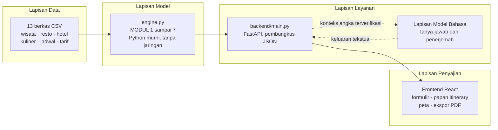
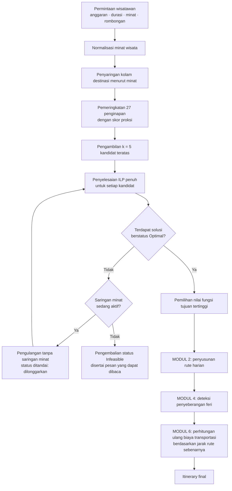
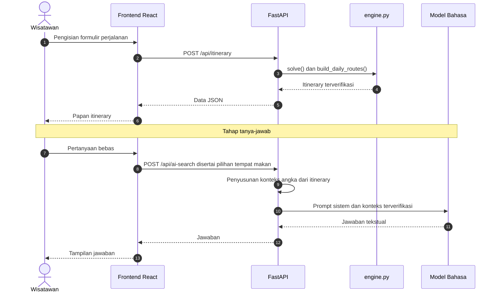

# DOKUMENTASI DESAIN DAN INDIKATOR KEBERHASILAN MODEL

## Sistem Perencanaan Perjalanan Cerdas TourCation AI
### Studi Kasus: Kawasan Pariwisata Danau Toba, Sumatera Utara

---

| | |
|---|---|
| **Jenis dokumen** | Dokumentasi desain teknis dan laporan hasil pengujian model |
| **Objek yang didokumentasikan** | Model optimasi `engine.py` (7 modul), antarmuka pemrograman `backend/main.py`, dan antarmuka pengguna `frontend/` |
| **Tanggal pengujian** | 21 Juli 2026 |
| **Versi dataset** | 13 berkas CSV bertanggal 13 Juli 2026 |
| **Dasar seluruh angka** | Skrip pengujian pada direktori `uji/`, dijalankan ulang pada saat dokumen ini disusun |

> **Pernyataan keterverifikasian.** Seluruh nilai numerik yang disajikan dalam dokumen ini merupakan
> keluaran langsung dari skrip pengujian yang disertakan dalam repositori, bukan kutipan dari catatan
> terdahulu maupun estimasi penulis. Prosedur untuk menghasilkan ulang setiap angka diuraikan pada
> [Bab 11](#11-prosedur-reproduksi).

---

## Daftar Isi

1. [Pendahuluan](#1-pendahuluan)
2. [Arsitektur Sistem](#2-arsitektur-sistem)
3. [Formulasi Model Optimasi](#3-formulasi-model-optimasi)
4. [Analisis Dekomposisi Koefisien](#4-analisis-dekomposisi-koefisien)
5. [Komponen Pendukung Model](#5-komponen-pendukung-model)
6. [Lapisan Kecerdasan Buatan Generatif](#6-lapisan-kecerdasan-buatan-generatif)
7. [Metodologi Pengujian](#7-metodologi-pengujian)
8. [Indikator Keberhasilan dan Hasil Pengukuran](#8-indikator-keberhasilan-dan-hasil-pengukuran)
9. [Analisis Sensitivitas dan Ablasi](#9-analisis-sensitivitas-dan-ablasi)
10. [Batas Operasi dan Keterbatasan yang Diketahui](#10-batas-operasi-dan-keterbatasan-yang-diketahui)
11. [Prosedur Reproduksi](#11-prosedur-reproduksi)
12. [Simpulan dan Rekomendasi Pengembangan](#12-simpulan-dan-rekomendasi-pengembangan)

---

## 1. Pendahuluan

### 1.1 Latar Belakang

Ketersediaan informasi kepariwisataan mengenai kawasan Danau Toba pada saat ini telah memadai.
Daftar destinasi, ulasan pengunjung, serta rentang harga akomodasi dapat diperoleh dengan mudah
melalui mesin pencari maupun peta digital. Permasalahan yang belum terjawab bukan terletak pada
ketersediaan informasi, melainkan pada tahap berikutnya, yaitu penyusunan keputusan atas informasi
tersebut.

Wisatawan yang memiliki keterbatasan anggaran dan waktu dihadapkan pada pertanyaan berikut:

> Dengan anggaran sebesar Rp5.000.000, durasi tiga hari, dan rombongan dua orang, **kombinasi
> destinasi, penginapan, serta tempat makan manakah** yang memberikan nilai perjalanan tertinggi,
> dan sejauh mana wisatawan memperoleh kepastian bahwa anggaran tersebut tidak akan terlampaui?

Pertanyaan di atas merupakan persoalan **optimasi berkendala** (*constrained optimization*), bukan
persoalan pencarian informasi. Atas dasar pertimbangan tersebut, inti sistem yang dikembangkan
dirancang sebagai model pemrograman linear bilangan bulat, sedangkan model bahasa berskala besar
ditempatkan semata-mata pada lapisan penjelas.

### 1.2 Rumusan Masalah

Persoalan yang diselesaikan model dapat dirumuskan sebagai berikut: diberikan himpunan destinasi
wisata, tempat makan, dan penginapan beserta atribut harga, penilaian, koordinat, dan jam
operasionalnya, tentukan subhimpunan yang memaksimalkan nilai perjalanan dengan tetap memenuhi
batasan anggaran, struktur agenda harian, serta preferensi minat wisatawan.

### 1.3 Tujuan Dokumen

Dokumen ini disusun untuk memenuhi tiga tujuan:

1. **Mendokumentasikan desain model** secara formal, mencakup formulasi matematis, asumsi yang
   digunakan, serta dasar pertimbangan setiap keputusan perancangan.
2. **Menetapkan indikator keberhasilan** yang terukur dan dapat diverifikasi secara independen.
3. **Melaporkan hasil pengujian** atas indikator tersebut, termasuk keterbatasan yang ditemukan.

### 1.4 Ruang Lingkup dan Batasan

Dokumen ini membahas model optimasi beserta modul pendukungnya, metodologi pengujian, dan hasil
pengukuran. Pembahasan mengenai rancangan antarmuka pengguna, prosedur pemasangan perangkat lunak,
serta panduan penggunaan aplikasi berada di luar ruang lingkup dokumen ini.

---

## 2. Arsitektur Sistem

Sistem disusun atas empat lapisan dengan pemisahan tanggung jawab yang tegas. Gambar 1 menyajikan
hubungan antarlapisan tersebut.



**Gambar 1.** Arsitektur berlapis sistem TourCation AI.

Prinsip perancangan yang dipertahankan adalah **sumber kebenaran tunggal** (*single source of
truth*). Lapisan layanan tidak menduplikasi logika perhitungan, dan lapisan penyajian tidak
menghitung ulang biaya. Pengecualian diberikan pada penghitungan skor dampak UMKM di sisi klien,
karena nilai tersebut harus berubah seketika ketika wisatawan menukar pilihan tempat makannya.

**Tabel 1.** Kewenangan dan larangan setiap lapisan.

| Lapisan | Kewenangan | Tindakan yang tidak diperkenankan |
|---|---|---|
| Data | Menjadi sumber seluruh nilai numerik | — |
| Model (`engine.py`) | Seluruh pengambilan keputusan dan perhitungan | Mengakses jaringan pada saat penyusunan rencana, kecuali layanan OSRM yang bersifat opsional |
| Layanan (`backend/main.py`) | Membungkus model menjadi antarmuka JSON | Menduplikasi maupun mengubah logika model |
| Model bahasa | Menjelaskan dan menerjemahkan | Memilih destinasi, menetapkan harga, atau melakukan penjumlahan biaya |
| Penyajian | Menampilkan hasil | Menghitung ulang biaya, kecuali skor UMKM sebagaimana dijelaskan di atas |

---

## 3. Formulasi Model Optimasi

Model inti diimplementasikan sebagai **Integer Linear Programming (ILP)** dan diselesaikan
menggunakan pemecah **CBC** melalui pustaka PuLP ([`engine.py:829`](engine.py:829)).

### 3.1 Notasi

Notasi yang digunakan sepanjang bab ini dirangkum pada Tabel 2.

**Tabel 2.** Notasi model.

| Simbol | Keterangan |
|---|---|
| $R$ | himpunan tempat makan yang memenuhi syarat, $\lvert R \rvert = 117$ |
| $A$ | himpunan destinasi wisata yang memenuhi syarat, $\lvert A \rvert = 137$ |
| $B$ | anggaran total yang ditetapkan wisatawan (rupiah) |
| $n_{hari}$ | durasi perjalanan (hari) |
| $n_{orang}$ | jumlah anggota rombongan |
| $d_i$ | jarak efektif objek ke-$i$ terhadap titik acuan (km) |
| $u_i$ | skor UMKM objek ke-$i$, bernilai pada rentang $[0,1]$ |
| $w_{jarak}, w_{umkm}, w_{util}$ | bobot penalti jarak, keberpihakan UMKM, dan utilisasi anggaran |

### 3.2 Variabel Keputusan

**Tabel 3.** Variabel keputusan model.

| Variabel | Domain | Interpretasi |
|---|---|---|
| $x^r_i$ | $\{0,1\}$ | bernilai 1 apabila tempat makan ke-$i$ dikunjungi |
| $x^a_j$ | $\{0,1\}$ | bernilai 1 apabila destinasi wisata ke-$j$ dimasukkan ke dalam rencana |

Batas atas $x^r_i \le 1$ ditetapkan secara sengaja. Pada rancangan sebelumnya batas tersebut bernilai
2, sehingga satu rumah makan dapat terpilih sebagai sarapan sekaligus makan siang pada hari yang
sama. Mengingat kolam data memuat 117 tempat makan, pembatasan ini tidak menyulitkan pemecah,
sementara kualitas rencana yang dihasilkan meningkat secara nyata.

### 3.3 Fungsi Tujuan

Model memaksimalkan penjumlahan skor seluruh objek terpilih, ditambah insentif utilisasi anggaran:

$$
\max \; Z = \sum_{i \in R} x^r_i \cdot s^r_i \;+\; \sum_{j \in A} x^a_j \cdot s^a_j
\;+\; \underbrace{\frac{E(x)}{B}\cdot w_{util} \cdot 10}_{\text{insentif utilisasi anggaran}}
$$

Skor masing-masing objek dirumuskan sebagai berikut:

$$
s^r_i = Q_i \;-\; \frac{d_i}{d_{\max}}\cdot 5 \cdot w_{jarak} \;+\; w_{umkm}\cdot 5 \cdot u_i
$$

$$
s^a_j = Q_j \;-\; \frac{d_j}{d_{\max}}\cdot 5 \cdot w_{jarak}
$$

dengan skor kualitas $Q$ didefinisikan sebagai kombinasi berbobot antara penilaian pengunjung dan
tingkat harga yang telah dinormalisasi:

$$
Q = 0{,}7\cdot \text{rating} \;+\; 0{,}3\cdot\frac{\text{harga}_{\min}}{\text{harga}^{ref}_{\max}}\cdot 5
$$

### 3.4 Koreksi Jarak Lintas Danau

Jarak $d_i$ yang digunakan pada fungsi tujuan bukanlah jarak Haversine murni, melainkan **jarak
efektif** yang telah dikoreksi:

$$
d_i = d^{\text{hav}}_i \;+\; P \cdot \mathbf{1}\!\left[\text{sisi}(i) \neq \text{sisi}(\text{acuan})\right],
\qquad P = 12{,}0 \text{ km}
$$

Koreksi ini diperlukan karena rumus Haversine menarik garis lurus yang **menembus perairan Danau
Toba**. Tanpa koreksi tersebut, destinasi di Pulau Samosir tampak berjarak dekat dari daratan,
padahal pencapaiannya menuntut satu perjalanan feri penuh. Penetapan nilai $P = 12{,}0$ tidak
didasarkan pada asumsi fisis, melainkan pada hasil kalibrasi empiris sebagaimana dilaporkan pada
[Subbab 9.4](#94-kalibrasi-penalti-lintas-danau).

### 3.5 Kendala

**Tabel 4.** Kendala model.

| Kode | Formulasi | Dasar pertimbangan |
|---|---|---|
| C1 | $M(x) \le B$ | Jaminan anggaran, dengan $M$ dihitung pada `harga_max` |
| C2 | $\displaystyle\sum_{i \in R} x^r_i = 3 \times n_{hari}$ | Setiap hari memuat sarapan, makan siang, dan makan malam |
| C3 | $\displaystyle n_{hari} \le \sum_{j \in A} x^a_j \le \text{maks}_{hari} \times n_{hari}$ | Kepadatan agenda yang ditetapkan wisatawan |

Kendala C1 merupakan properti terpenting dari model ini dan layak memperoleh penjelasan tersendiri.
Besaran yang dibatasi bukanlah biaya estimasi $E(x)$, melainkan biaya pada **skenario terburuk**
$M(x)$, yaitu total yang dihitung menggunakan batas atas rentang harga setiap objek:

$$
M(x) = \underbrace{h_{\max}\cdot n_{kamar}\cdot n_{malam}}_{\text{akomodasi}}
\;+\; n_{orang}\!\!\sum_{i \in R}\! x^r_i p^{r}_{i,\max}
\;+\; n_{orang}\!\!\sum_{j \in A}\! x^a_j p^{a}_{j,\max}
\;+\; T(x)
$$

Dengan demikian, rencana yang dilaporkan sistem sebagai "sesuai anggaran" tetap terpenuhi meskipun
seluruh penyedia jasa menagih pada ujung atas rentang harganya. Komponen biaya transportasi $T(x)$
turut dicadangkan **di dalam** kendala tersebut, bukan ditambahkan setelah proses optimasi selesai.
Apabila biaya transportasi hanya ditampilkan pada akhir perhitungan, jaminan anggaran akan gugur
pada saat jarak tempuh rencana ternyata jauh.

### 3.6 Penanganan Penginapan di Luar Variabel Keputusan

Penginapan merupakan komponen biaya terbesar sekaligus titik acuan bagi seluruh penalti jarak.
Menjadikannya variabel keputusan akan mengubah suku penalti menjadi **bilinear**, yaitu perkalian
antara variabel penginapan dan variabel destinasi, sehingga menuntut prosedur linearisasi yang
memperbesar ukuran model secara signifikan.

Sehubungan dengan pertimbangan tersebut, ditempuh pendekatan dua lapis. Pada lapis pertama, seluruh
27 penginapan diberi peringkat menggunakan skor proksi:

$$
S^{hotel} = 0{,}50 \cdot \tilde{n}\!\left(\bar{d}_{kuota}\right)^{-}
\;+\; 0{,}30 \cdot \tilde{n}\!\left(\text{rating}\right)
\;+\; 0{,}20 \cdot \tilde{n}\!\left(c_{inap}\right)^{-}
$$

dengan $\tilde{n}(\cdot)$ menyatakan normalisasi min–maks dan tanda $(-)$ menyatakan pembalikan arah,
yakni nilai yang lebih kecil memperoleh skor lebih tinggi. Besaran $\bar{d}_{kuota}$ dihitung sebagai
rata-rata jarak ke sejumlah destinasi terdekat sebanyak kuota perjalanan, bukan ke seluruh kolam
data. Pertimbangannya, penginapan yang dikelilingi tiga destinasi berjarak dekat lebih bermanfaat
daripada penginapan yang secara rata-rata dekat terhadap 137 destinasi yang tidak seluruhnya akan
dikunjungi.

Pada lapis kedua, sebanyak $k = 5$ kandidat teratas **benar-benar dijalankan melalui ILP secara
penuh**, kemudian kandidat dengan nilai fungsi tujuan tertinggi yang dipilih. Beban komputasi
tambahan atas prosedur ini terukur sekitar 0,5 detik.

Konsekuensi metodologis dinyatakan secara terbuka: status *Optimal* yang dilaporkan pemecah
merupakan optimum **bersyarat** terhadap penginapan terpilih. Besaran celah optimalitas yang
ditimbulkannya diukur dan dilaporkan pada [Subbab 10.1](#101-celah-optimalitas-penginapan).

### 3.7 Alur Penyelesaian Permintaan

Gambar 2 menyajikan alur lengkap penyelesaian satu permintaan perencanaan, termasuk mekanisme
pelonggaran saringan minat.



**Gambar 2.** Alur penyelesaian permintaan perencanaan perjalanan.

---

## 4. Analisis Dekomposisi Koefisien

Fungsi tujuan yang tersusun rapi secara notasi belum tentu memberikan pengaruh yang seimbang dalam
praktik. Sehubungan dengan hal tersebut, dilakukan audit terhadap rentang nilai riil setiap suku pada
seluruh 117 tempat makan, dengan skenario anggaran Rp5.000.000, durasi tiga hari, dan rombongan dua
orang ([`uji/audit_model.py`](uji/audit_model.py)).

**Tabel 5.** Dekomposisi rentang nilai setiap suku fungsi tujuan.

| Suku | Minimum | Median | Maksimum | Rentang |
|---|---:|---:|---:|---:|
| Rating | 1,89 | 3,08 | 3,50 | 1,61 |
| **Penalti jarak** | −3,25 | −2,18 | −0,01 | **3,23** |
| UMKM | 0,00 | 0,88 | 1,75 | 1,75 |
| Harga–kualitas | 0,02 | 0,50 | 1,50 | 1,48 |
| Insentif utilisasi anggaran | 0,02 | 0,08 | 0,18 | 0,16 |

Berdasarkan Tabel 5 dapat dikemukakan tiga temuan.

**Pertama**, penalti jarak merupakan suku dengan daya pisah terbesar dengan rentang 3,23. Suku
tersebut mampu membalik urutan peringkat yang dihasilkan oleh rating. Kondisi ini bersifat disengaja,
mengingat sebaran rating pada dataset ini sangat sempit, yaitu 4,45 hingga 4,97, sehingga jarak
menjadi pembeda yang jauh lebih informatif.

**Kedua**, insentif utilisasi anggaran memiliki pengaruh yang nyaris dapat diabaikan, dengan rentang
0,16 berbanding 3,23. Kondisi ini bukan merupakan kekeliruan implementasi, melainkan pilihan
perancangan yang dasar empirisnya diuraikan pada [Subbab 9.3](#93-bobot-utilisasi-anggaran-w_util).

**Ketiga**, korelasi antara harga dan skor total tempat makan terukur sebesar **0,102**, yang secara
praktis dapat dianggap nol. Dengan demikian, kekhawatiran bahwa model condong memilih tempat mahal
akibat kehadiran suku harga bertanda positif pada $Q$ tidak terbukti.

---

## 5. Komponen Pendukung Model

**Tabel 6.** Modul pendukung beserta keputusan perancangannya.

| Modul | Fungsi | Keputusan perancangan yang menonjol |
|---|---|---|
| **MODUL 2**<br/>Rute harian | Pengelompokan destinasi per hari dan pengurutan *nearest-neighbour* | Benih kelompok diambil dari destinasi **terjauh**, kemudian ditarik tetangga terdekatnya. Pengupasan gugusan terjauh terlebih dahulu menyebabkan destinasi terpencil terkumpul pada hari yang sama, sehingga penyeberangan feri cukup dilakukan sekali dan tidak tersebar setiap hari |
| **MODUL 3 / 3c**<br/>Kesadaran waktu | Penguraian jam operasional dan jadwal mingguan | Apabila penyaringan akan menyisakan destinasi yang terlalu sedikit, saringan **dilonggarkan** disertai status eksplisit `dilonggarkan`. Rencana yang disertai peringatan dinilai lebih bermanfaat daripada tidak memberikan rencana sama sekali |
| **MODUL 3b**<br/>Agenda harian | Tiga slot makan pada rentang 07.00–19.00 beserta jendela wisata pagi dan sore | Setiap slot makan disertai tiga alternatif sepadan agar wisatawan dapat menukarnya tanpa merusak struktur anggaran |
| **MODUL 4**<br/>Deteksi feri | Pengenalan penyeberangan Samosir–daratan | Penyeberangan dideteksi dari rantai rute yang sebenarnya, kemudian **dibebankan** pada biaya transportasi |
| **MODUL 5**<br/>Skor UMKM | Penilaian keberpihakan usaha lokal | Tiga sinyal berbobot, sebagaimana dirumuskan pada Persamaan (1) |
| **MODUL 6**<br/>Biaya transportasi | Perhitungan bahan bakar dan tarif feri per moda | Seluruh angka dinyatakan sebagai asumsi terbuka, disertai penanda `realistis` yang memperingatkan ketidaksesuaian moda |
| **MODUL 7**<br/>Fasilitas umum | Penyajian SPBU, ATM, apotek, dan klinik per kabupaten | Bagi pengendara, SPBU didahulukan karena MODUL 6 telah membebankan biaya bahan bakarnya |

### 5.1 Perumusan Skor UMKM

Skor keberpihakan usaha mikro, kecil, dan menengah dihitung sebagai kombinasi berbobot atas tiga
sinyal yang seluruhnya dapat ditelusuri ke dataset:

$$
u = 0{,}5 \cdot \mathbf{1}[\text{kuliner khas Batak}]
\;+\; 0{,}3 \cdot \mathbf{1}[\text{nama lokal}]
\;+\; 0{,}2 \cdot \mathbf{1}[\text{harga terjangkau}]
$$

Sinyal nama lokal dikenali melalui pola penamaan khas seperti BPK, RM, Lapo, Kedai, Warung, Rumah
Makan, dan Pondok. Sinyal harga terjangkau ditetapkan pada ambang Rp25.000. Suatu usaha
diklasifikasikan sebagai **UMKM lokal otentik** apabila $u \ge 0{,}5$.

### 5.2 Perumusan Biaya Transportasi

Biaya transportasi dihitung terpisah untuk kendaraan pribadi dan angkutan umum:

$$
T = \begin{cases}
\text{km}_{total} \cdot \tau_{km} + \phi \cdot n_{feri} & \text{kendaraan pribadi} \\[4pt]
\tau_{umum} \cdot n_{orang} \cdot n_{hari} + \phi \cdot n_{feri} \cdot n_{orang} & \text{angkutan umum}
\end{cases}
$$

Seluruh parameter tarif dinyatakan sebagai asumsi terbuka dan bukan tarif resmi, yaitu harga bahan
bakar Rp10.000 per liter, konsumsi sepeda motor 45 km per liter yang setara Rp225 per kilometer,
serta konsumsi mobil 12 km per liter yang setara Rp850 per kilometer. Sistem juga menetapkan penanda
kelayakan moda melalui pertidaksamaan $\text{km}_{total}/n_{hari} \le \text{batas}_{moda}$, sehingga
permintaan menempuh 60 km per hari dengan berjalan kaki akan memperoleh peringatan, bukan diterima
secara diam-diam.

---

## 6. Lapisan Kecerdasan Buatan Generatif

Model bahasa berskala besar dimanfaatkan pada tiga fungsi saja, yaitu tanya-jawab pada kotak
pencarian, penerjemahan antarmuka, dan penerjemahan percakapan. Model tersebut **tidak memiliki
kewenangan** untuk memilih destinasi, menetapkan harga, maupun menyusun rencana perjalanan.

Gambar 3 memperlihatkan pemisahan kewenangan tersebut dalam bentuk diagram sekuens.



**Gambar 3.** Diagram sekuens interaksi wisatawan dengan sistem.

### 6.1 Ketentuan yang Ditegakkan pada Prompt Sistem

Ketentuan berikut ditanamkan pada prompt sistem ([`backend/main.py:689`](backend/main.py:689)):

1. **Nilai numerik konkret wajib bersumber dari konteks itinerary yang disuntikkan.** Model dilarang
   mengarang maupun memperkirakan angka. Apabila data tidak tersedia, model diwajibkan menyatakannya
   secara terus terang.
2. **Pertanyaan umum mengenai kawasan Danau Toba** diperkenankan dijawab dari pengetahuan model,
   dengan syarat jawaban tersebut ditandai sebagai pengetahuan umum dan bukan berasal dari dataset
   aplikasi.
3. **Pertanyaan di luar topik** dialihkan kembali secara sopan pada cakupan yang dapat dilayani.

### 6.2 Pengaman Tambahan

Dua pengaman tambahan diterapkan untuk menjaga keandalan lapisan ini.

**Pengaman pertama, operasi aritmetika tidak diserahkan kepada model bahasa.** Subtotal biaya makan
per hari serta total biaya perjalanan dihitung terlebih dahulu pada sisi Python, kemudian disajikan
dalam bentuk jadi kepada model. Dasar pertimbangannya, model bahasa tidak dapat diandalkan untuk
menjumlahkan angka yang tersebar pada konteks yang panjang. Konteks yang disuntikkan juga mengikuti
tempat makan yang sedang dipilih wisatawan, bukan rekomendasi awal sistem.

**Pengaman kedua, penerjemahan antarmuka tidak pernah membawa nilai numerik.** Data yang dikirimkan
terbatas pada label antarmuka, sedangkan harga, koordinat, dan jam operasional tetap berada di sisi
klien. Prompt penerjemahan turut memuat instruksi eksplisit untuk tidak menuruti perintah yang
mungkin tersisip di dalam teks yang diterjemahkan.

---

## 7. Metodologi Pengujian

### 7.1 Rancangan Matriks Skenario

Pengujian indikator utama dilaksanakan atas matriks faktorial penuh yang dibentuk dari tiga faktor:

$$
\underbrace{6}_{\text{kombinasi anggaran} \times \text{durasi}}
\times
\underbrace{5}_{\text{pilihan minat}}
\times
\underbrace{3}_{\text{ukuran rombongan}}
= 90 \text{ skenario}
$$

Adapun tataran setiap faktor adalah sebagai berikut:

- **Anggaran dan durasi:** Rp1.500.000/2 hari, Rp3.000.000/3 hari, Rp5.000.000/3 hari,
  Rp8.000.000/4 hari, Rp12.000.000/5 hari, dan Rp2.000.000/1 hari.
- **Minat wisata:** tanpa minat, Alam, Budaya, Rohani, serta kombinasi Alam dan Budaya.
- **Ukuran rombongan:** 1, 2, dan 4 orang.

Seluruh skenario menggunakan tanggal keberangkatan Senin, 3 Agustus 2026, dengan maksud agar
mekanisme penghindaran penutupan mingguan turut teruji.

### 7.2 Kendali Pengujian

Seluruh skenario dijalankan dengan parameter `use_osrm=False`, sehingga jarak dihitung menggunakan
rumus Haversine. Ketentuan ini ditetapkan agar hasil pengujian **dapat direproduksi tanpa
ketergantungan pada jaringan** maupun pada ketersediaan peladen OSRM publik. Dampak penggunaan OSRM
terhadap waktu komputasi dilaporkan tersendiri pada [Subbab 8.2](#82-catatan-atas-indikator-k5-dan-k9).

---

## 8. Indikator Keberhasilan dan Hasil Pengukuran

### 8.1 Rekapitulasi Indikator

Tabel 7 menyajikan definisi operasional, target, dan hasil pengukuran atas 90 skenario
([`uji/indikator_engine.py`](uji/indikator_engine.py)).

**Tabel 7.** Indikator keberhasilan model dan hasil pengukurannya.

| Kode | Indikator | Definisi operasional | Target | Hasil pengukuran | Status |
|---|---|---|---|---|:--:|
| K1 | Kelayakan solusi | Pemecah mengembalikan status `Optimal` | ≥ 95% | **100%** (90 dari 90) | Tercapai |
| K2 | Kepatuhan anggaran | Terpenuhinya $M(x) \le B$ pada harga terburuk | 0 pelanggaran | **0 pelanggaran** | Tercapai |
| K3 | Kebenaran struktur agenda | Jumlah kunjungan makan tepat $3 \times n_{hari}$ | 100% | **100%** | Tercapai |
| K4 | Keterpenuhan minat | Proporsi destinasi yang sesuai minat wisatawan | ≥ 80% | **100%** pada 72 dari 72 skenario berminat, tanpa pelonggaran | Tercapai |
| K5 | Waktu komputasi | Durasi penyelesaian satu rencana | median < 1 detik | **0,416 detik** (min 0,304; maks 0,930) | Tercapai |
| K6 | Mutu destinasi | Rata-rata rating destinasi terpilih | ≥ 4,3 | **4,641** (min 4,450; maks 4,967) | Tercapai |
| K7 | Keberpihakan UMKM | Persentase kunjungan makan dengan $u \ge 0{,}5$ | ≥ 70% | **95,0%** (median 100%; min 83,3%) | Tercapai |
| K8 | Ragam kuliner khas | Banyaknya jenis kuliner Batak berbeda yang dicicipi | ≥ 3 | **6,444** (median 7) | Tercapai |
| K9 | Kerapatan rute | Jarak tempuh per hari | median < 15 km | **6,623 km** (rata-rata 14,320; maks 42,937) | Tercapai |
| K10 | Efisiensi penyeberangan | Banyaknya penyeberangan feri per rencana | < 1 | **0,367** (maks 2) | Tercapai |
| K11 | Kelayakan moda | Rencana yang melampaui batas kilometer harian modanya | 0 | **0** | Tercapai |
| K12 | Transparansi penyaringan jam | Destinasi yang dikeluarkan karena tutup | dilaporkan | rata-rata **0,033** per rencana | Tercapai |

Waktu penyusunan rute harian pada MODUL 2 diukur secara terpisah dan terbukti nyaris tidak
membebani, yaitu **median 0,001 detik** dengan maksimum 0,008 detik. Keseluruhan 90 skenario
diselesaikan dalam **38,7 detik**.

### 8.2 Catatan atas Indikator K5 dan K9

Dua catatan perlu dikemukakan agar pembacaan Tabel 7 tidak menimbulkan kesimpulan yang berlebihan.

**Terkait K5**, pengukuran dilakukan pada moda perhitungan jarak Haversine sesuai kendali pengujian
pada Subbab 7.2. Apabila layanan OSRM diaktifkan, penyusunan satu rencana penuh membutuhkan **6,16
detik**, atau sekitar lima belas kali lebih lama. Tambahan waktu tersebut ditukar dengan jarak jalan
yang sesungguhnya, yaitu 19,56 km pada skenario uji.

**Terkait K9**, distribusi hasil memiliki ekor yang panjang, dengan rata-rata 14,320 km namun
maksimum mencapai 42,937 km. Skenario ekstrem tersebut merupakan perjalanan satu hari dengan minat
sempit, yakni kondisi ketika destinasi yang memenuhi syarat memang terletak berjauhan.

---

## 9. Analisis Sensitivitas dan Ablasi

Bab ini menyajikan bukti bahwa nilai parameter model ditetapkan berdasarkan hasil pengukuran, bukan
berdasarkan penetapan sepihak.

### 9.1 Bobot Gaya Jelajah ($w_{jarak}$)

**Tabel 8.** Ablasi bobot penalti jarak.

| Gaya jelajah | $w_{jarak}$ | Jarak rata-rata | Rating rata-rata | Total feri |
|---|---:|---:|---:|---:|
| Jelajah jauh | 0,15 | **120,4 km** | 4,607 | 3 |
| Seimbang | 0,60 | 39,5 km | 4,622 | 0 |
| Dekat-dekat *(nilai baku)* | 1,20 | **14,2 km** | **4,667** | 0 |

Peningkatan bobot dari 0,15 menjadi 1,20 memangkas jarak tempuh sebesar **8,5 kali lipat**, sementara
rating justru **meningkat** sebesar 0,060. Temuan ini menunjukkan bahwa nilai baku terdahulu, yaitu
0,15, membebankan tambahan jarak lebih dari 100 km tanpa memberikan peningkatan mutu apa pun. Ketiga
nilai tersebut tetap ditawarkan kepada wisatawan sebagai pilihan **selera**, bukan sebagai perkara
benar atau salah.

### 9.2 Bobot Keberpihakan UMKM ($w_{umkm}$)

**Tabel 9.** Sensitivitas terhadap bobot UMKM.

| $w_{umkm}$ | Proporsi UMKM | Ragam kuliner | Total biaya | Rating tempat makan |
|---:|---:|---:|---:|---:|
| 0,00 | 55,6% | 6 | Rp1.768.513 | 4,656 |
| 0,25 | **100%** | 7 | Rp1.439.834 | 4,422 |
| 0,50 *(profil Otentik Lokal)* | 100% | 7 | Rp1.414.834 | 4,444 |
| 0,75 | 100% | 7 | Rp1.414.834 | 4,444 |
| 1,00 | 100% | 7 | Rp1.414.834 | 4,444 |

Bobot ini terbukti bekerja sebagaimana dirancang, sekaligus mencapai titik jenuh dengan cepat. Nilai
0,25 telah memadai untuk mencapai proporsi 100%, sedangkan penambahan di atas 0,50 tidak lagi
menimbulkan perubahan. Pertukaran yang menyertainya dinyatakan secara terbuka, yaitu penurunan rating
tempat makan sebesar 0,212 dan penurunan total biaya sebesar 20,0%. Keempat profil wisatawan yang
tersedia, dengan bobot 0,08; 0,22; 0,35; dan 0,50, dengan demikian menempati rentang hasil yang
benar-benar berbeda.

### 9.3 Bobot Utilisasi Anggaran ($w_{util}$)

**Tabel 10.** Sensitivitas terhadap bobot utilisasi anggaran.

| $w_{util}$ | Utilisasi anggaran | Rating destinasi | Jarak rata-rata |
|---:|---:|---:|---:|
| 0,0 sampai 1,0 | 0,283 | 4,667 | 1,9 km |
| 2,0 | 0,317 | 4,622 | 5,0 km |
| 5,0 | 0,423 | 4,567 | **8,4 km** |

Tabel 10 menjelaskan alasan bobot ini sengaja ditetapkan lemah pada nilai baku 0,5. Satu-satunya cara
yang tersedia bagi model untuk membelanjakan anggaran lebih besar adalah menempuh jarak lebih jauh
dan menurunkan mutu destinasi. Peningkatan bobot menjadi 5,0 memperoleh tambahan utilisasi sebesar 14
poin persentase dengan biaya penurunan rating sebesar 0,100 dan pelipatgandaan jarak sebesar 4,4 kali.

Konsekuensi yang harus dinyatakan secara terbuka adalah bahwa **utilisasi anggaran rata-rata hanya
mencapai 39,9%** dengan median 35,7%. Sistem ini secara sadar mengembalikan rencana yang lebih murah
daripada kemampuan bayar wisatawan, kemudian menampilkan selisihnya sebagai sisa anggaran, dan tidak
berupaya mencari cara untuk membelanjakannya.

### 9.4 Kalibrasi Penalti Lintas Danau

Nilai $P = 12{,}0$ bukan merupakan pernyataan fisis bahwa satu penyeberangan setara dengan 12
kilometer, melainkan bobot yang dikalibrasi dari hasil pengukuran melalui sapuan delapan nilai atas
30 skenario ([`uji/kalibrasi_seberang.py`](uji/kalibrasi_seberang.py)).

**Tabel 11.** Kalibrasi parameter `PENALTI_SEBERANG_KM`.

| $P$ (km) | Feri rata-rata | Feri maks. | Jarak/hari (median) | Rating | Biaya rata-rata |
|---:|---:|---:|---:|---:|---:|
| 0 | 0,53 | 4 | 6,4 km | 4,630 | Rp2.413.093 |
| 10 | **0,20** | 2 | **6,3 km** | **4,639** | Rp2.362.086 |
| **12** *(nilai baku)* | **0,20** | 2 | **6,3 km** | 4,638 | **Rp2.358.792** |
| 15 | 0,27 | 2 | 6,6 km | 4,630 | Rp2.367.133 |
| 20 | 0,27 | 2 | 6,7 km | 4,623 | Rp2.360.827 |
| 25 | 0,20 | 2 | 7,6 km | 4,622 | Rp2.382.139 |
| 30 | 0,20 | 2 | **12,2 km** | 4,617 | Rp2.415.431 |
| 60 | 0,20 | 2 | 13,5 km | 4,620 | Rp2.469.566 |

Rentang 10 sampai 12 merupakan satu-satunya wilayah yang unggul pada seluruh sumbu pengukuran secara
bersamaan. Banyaknya penyeberangan turun dari 0,53 menjadi 0,20 per rencana dengan maksimum berkurang
dari 4 menjadi 2, jarak per hari sedikit membaik, rating meningkat tipis, dan biaya rata-rata justru
paling rendah. Peningkatan nilai melampaui rentang tersebut bersifat **kontraproduktif**. Pada
$P = 30$, jarak per hari melonjak hampir dua kali lipat, dari 6,3 km menjadi 12,2 km, karena upaya
menghindari feri dengan segala cara memaksa rencana menyebar jauh pada satu sisi danau, sementara
banyaknya penyeberangan tidak lagi berkurang.

### 9.5 Perbandingan Metode Pemilihan Penginapan

Rumus terdahulu memberikan suku harga bertanda **positif**, sehingga penginapan yang lebih mahal
memperoleh skor lebih tinggi. Perbandingan langsung dilaksanakan pada mesin yang sama persis, dengan
cara mereproduksi rumus lama untuk menentukan penginapan yang dahulu akan terpilih, kemudian menyusun
ulang rencana melalui parameter `hotel_pilihan`
([`uji/perbandingan_hotel.py`](uji/perbandingan_hotel.py)).

**Tabel 12.** Perbandingan metode pemilihan penginapan lama dan baru.

| Skenario | Penginapan (metode lama) | Penginapan (metode baru) | Selisih biaya | Penghematan |
|---|---|---|---:|---:|
| Rp1,5 jt / 2 hari / 2 orang | Vany Villa Balige (Rp700.000) | Romlan Guesthouse (Rp200.000) | −Rp54.855 | 4,2% |
| Rp3 jt / 3 hari / 2 orang | Vany Villa Balige (Rp700.000) | Brussels Homestay (Rp280.000) | −Rp1.013.854 | 41,7% |
| Rp5 jt / 3 hari / 2 orang | Labersa Hotel (Rp900.000) | Brussels Homestay (Rp280.000) | −Rp1.210.651 | 46,1% |
| Rp8 jt / 4 hari / 2 orang | Labersa Hotel (Rp900.000) | Brussels Homestay (Rp280.000) | −Rp1.858.590 | 48,9% |
| Rp12 jt / 5 hari / 4 orang | Vany Villa Balige (Rp700.000) | Brussels Homestay (Rp280.000) | −Rp3.376.092 | 40,9% |

Secara ringkas, metode baru menghasilkan penghematan rata-rata sebesar **36,4%** dengan total
**Rp7.514.042** pada lima skenario, disertai penurunan jarak rata-rata ke destinasi sebesar 0,78 km,
sementara rating hampir tidak berubah dengan selisih −0,024.

Satu hasil yang tidak membaik turut dilaporkan tanpa disembunyikan. Pada skenario anggaran paling
tipis, yaitu Rp1,5 juta, metode baru menambah **dua penyeberangan feri**, memperpanjang rute sebesar
4,31 km, dan menurunkan rating sebesar 0,167, hanya demi penghematan sebesar 4,2%. Pada tataran
anggaran tersebut, tekanan harga mengungguli tekanan kedekatan. Kondisi ini dinilai sebagai
pertukaran yang tidak menguntungkan dan dicatat sebagai kelemahan yang diketahui.

---

## 10. Batas Operasi dan Keterbatasan yang Diketahui

### 10.1 Celah Optimalitas Penginapan

Sebagaimana dikemukakan pada Subbab 3.6, penginapan dipilih di luar ILP sehingga status optimal
bersifat bersyarat. Untuk mengukur besaran celah tersebut, dilaksanakan pengujian tanding dengan cara
memaksa **seluruh 27 penginapan** secara bergantian menjadi titik acuan, menjalankan ILP secara penuh
pada masing-masing, kemudian mengurutkan hasilnya.

**Tabel 13.** Tiga penginapan terbaik menurut jarak rata-rata ke destinasi.

| Peringkat | Penginapan | Harga | Rating | Jarak rata-rata | Total estimasi |
|---:|---|---:|---:|---:|---:|
| 1 | RAP Hotel Balige | Rp240.000 | 4,0 | 1,9 km | Rp1.319.555 |
| 2 | **Brussels Homestay** *(terpilih sistem)* | Rp280.000 | 4,6 | 1,9 km | Rp1.414.834 |
| 3 | Purnama Balige Hotel | Rp400.000 | 4,0 | 1,9 km | Rp1.639.414 |

Penginapan yang dipilih sistem menempati **peringkat kedua dari 27** menurut jarak rata-rata, dengan
capaian jarak 1,9 km yang **identik** dengan capaian terbaik. Perbedaan terletak pada biaya, yaitu
selisih 7,2% yang ditukar dengan rating penginapan lebih tinggi, dari 4,0 menjadi 4,6. Dengan
demikian, celah optimalitas pada skenario ini tergolong kecil dan dapat dipertanggungjawabkan. Perlu
ditegaskan bahwa pengujian ini dilaksanakan pada satu skenario, sehingga belum dapat diperlakukan
sebagai jaminan menyeluruh.

### 10.2 Ambang Anggaran Minimum

Ambang anggaran minimum yang masih menghasilkan solusi ditentukan melalui pencarian biner pada
rombongan dua orang dengan moda mobil.

**Tabel 14.** Ambang anggaran minimum menurut durasi perjalanan.

| Durasi | Anggaran minimum yang masih terpecahkan |
|---|---:|
| 1 hari | Rp130.277 |
| 2 hari | Rp334.376 |
| 3 hari | Rp533.736 |
| 5 hari | Rp1.105.909 |

Pada anggaran di bawah ambang tersebut, sistem mengembalikan status **`Infeasible`** disertai pesan
yang dapat dibaca pengguna, dan **tidak** menyusun rencana rekaan yang tidak mungkin dijalankan.
Perilaku ini diuji secara eksplisit dan bukan merupakan kebetulan implementasi.

### 10.3 Cakupan Data

**Tabel 15.** Cakupan dataset setelah proses pembersihan.

| Aspek | Cakupan | Keterangan |
|---|---|---|
| Destinasi wisata | 137 | setelah pembuangan baris tanpa koordinat atau harga |
| Tempat makan | 117 | setelah pembuangan entitas yang beririsan dengan dataset penginapan |
| Penginapan | 27 | — |
| Deteksi kabupaten | **134 dari 137 (97,8%)** | dasar kerja MODUL 7 |
| **Jadwal mingguan** | **20 dari 137 (14,6%)** | keterbatasan paling serius |
| Destinasi dengan hari tutup tercatat | 1 | — |

Keterbatasan paling serius sistem ini terletak pada cakupan jadwal mingguan. Mekanisme penghindaran
penutupan mingguan pada MODUL 3c hanya dapat bekerja atas 20 dari 137 destinasi. Terhadap 117
destinasi selebihnya, sistem hanya mengetahui jam buka tanpa informasi hari, sehingga kondisi
seperti museum yang tutup setiap hari Senin tidak selalu dapat dihindari. Keterbatasan ini bersumber
dari dataset dan bukan dari algoritma, namun tetap merupakan batas nyata yang wajib disampaikan
kepada pengguna.

### 10.4 Keterbatasan Lain

**Tabel 16.** Keterbatasan lain yang dinyatakan secara terbuka.

| Keterbatasan | Dampak terhadap hasil |
|---|---|
| Tarif transportasi merupakan asumsi, bukan tarif resmi | Biaya bahan bakar dan feri dapat meleset apabila harga berubah |
| Dataset feri hanya memuat rentang Rp3.500 sampai Rp250.000 tanpa rincian jenis kendaraan | Tarif per moda merupakan hasil interpolasi, khususnya sepeda motor pada 10% rentang yang sepenuhnya bersifat perkiraan |
| Dataset angkutan umum hanya memuat empat operator antarkota | Tarif angkutan lokal tidak tersedia sehingga didekati dengan median tarif tengah |
| Optimum bersifat bersyarat terhadap penginapan | Diuraikan pada Subbab 10.1 |
| Utilisasi anggaran rendah pada 39,9% | Merupakan pilihan perancangan, diuraikan pada Subbab 9.3 |
| Lapisan model bahasa bersifat non-deterministik | Jawaban di luar konteks itinerary tidak dijamin akurat sehingga wajib ditandai sebagai pengetahuan umum |

---

## 11. Prosedur Reproduksi

Seluruh angka pada dokumen ini dapat dihasilkan ulang melalui perintah berikut, dijalankan dari
direktori akar repositori dengan lingkungan virtual yang telah diaktifkan.

```bash
python uji/indikator_engine.py      # Bab 8            — 90 skenario, ±39 detik
python uji/ablasi_dan_cakupan.py    # Subbab 9.1, 10.2, 10.3
python uji/audit_model.py           # Bab 4, Subbab 9.2, 9.3, 10.1
python uji/perbandingan_hotel.py    # Subbab 9.5
python uji/kalibrasi_seberang.py    # Subbab 9.4      — 8 nilai × 30 skenario
```

Seluruh skrip menggunakan parameter `use_osrm=False` sehingga hasilnya dapat direproduksi tanpa
koneksi jaringan dan tanpa ketergantungan pada ketersediaan peladen OSRM publik. Angka pada dokumen
ini dihasilkan atas dataset bertanggal 13 Juli 2026. Menjalankan ulang skrip setelah dataset
diperbarui **akan** menggeser hasil pengukuran, dan pergeseran tersebut memang merupakan perilaku
yang dikehendaki.

---

## 12. Simpulan dan Rekomendasi Pengembangan

### 12.1 Simpulan

Berdasarkan hasil pengujian atas 90 skenario, dapat disimpulkan tiga hal berikut.

**Pertama**, model optimasi yang dikembangkan memenuhi seluruh dua belas indikator keberhasilan yang
ditetapkan. Capaian yang paling menentukan adalah tingkat kelayakan solusi sebesar 100%, tidak adanya
pelanggaran anggaran pada skenario harga terburuk, serta waktu komputasi median sebesar 0,416 detik
yang memadai untuk penggunaan interaktif.

**Kedua**, penetapan nilai parameter model didasarkan pada hasil pengukuran empiris. Hal ini
dibuktikan melalui analisis ablasi bobot jarak, sensitivitas bobot UMKM dan utilisasi anggaran, serta
kalibrasi penalti lintas danau sebagaimana dilaporkan pada Bab 9.

**Ketiga**, keterbatasan sistem telah diidentifikasi dan diukur, tidak sekadar dinyatakan secara
kualitatif. Keterbatasan terpenting terletak pada cakupan jadwal mingguan yang hanya mencapai 14,6%.

### 12.2 Sikap Perancangan yang Melandasi Sistem

Tiga prinsip berikut konsisten melandasi seluruh keputusan perancangan yang telah diuraikan.

1. **Menolak lebih baik daripada mengarang.** Anggaran di bawah ambang menghasilkan status
   `Infeasible` disertai pesan yang jelas; nilai yang tidak tersedia dinyatakan tidak tersedia oleh
   lapisan model bahasa; modal yang tidak realistis memperoleh penanda peringatan.
2. **Setiap angka wajib memiliki asal-usul.** Seluruh konstanta yang tidak bersumber dari dataset,
   yaitu penalti lintas danau, bobot jarak, dan tarif bahan bakar, dinyatakan sebagai asumsi terbuka
   pada dokumentasi kode, dan konstanta yang berpengaruh besar dikalibrasi melalui skrip pengujian
   yang dapat dijalankan ulang.
3. **Kompromi ditampilkan, bukan disembunyikan.** Status `dilonggarkan` pada saringan minat dan jam
   operasional menjadikan kompromi tersebut kasat mata bagi pengguna.

### 12.3 Rekomendasi Pengembangan Lanjutan

Empat arah pengembangan berikut direkomendasikan berdasarkan keterbatasan yang teridentifikasi.

1. **Pelengkapan dataset jadwal mingguan** bagi 117 destinasi yang belum tercakup. Rekomendasi ini
   menempati prioritas tertinggi karena bersifat menghilangkan keterbatasan paling serius tanpa
   menuntut perubahan algoritma.
2. **Integrasi penginapan sebagai variabel keputusan** melalui linearisasi suku bilinear, sehingga
   status optimal tidak lagi bersifat bersyarat.
3. **Pemutakhiran parameter tarif transportasi** dari sumber resmi, menggantikan asumsi terbuka yang
   digunakan saat ini.
4. **Perluasan pengujian celah optimalitas** dari satu skenario menjadi matriks penuh
